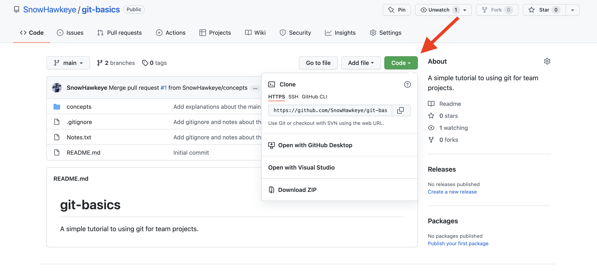
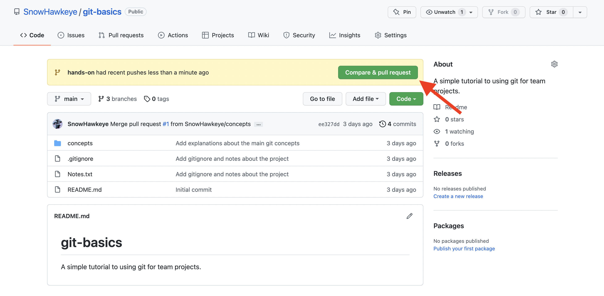
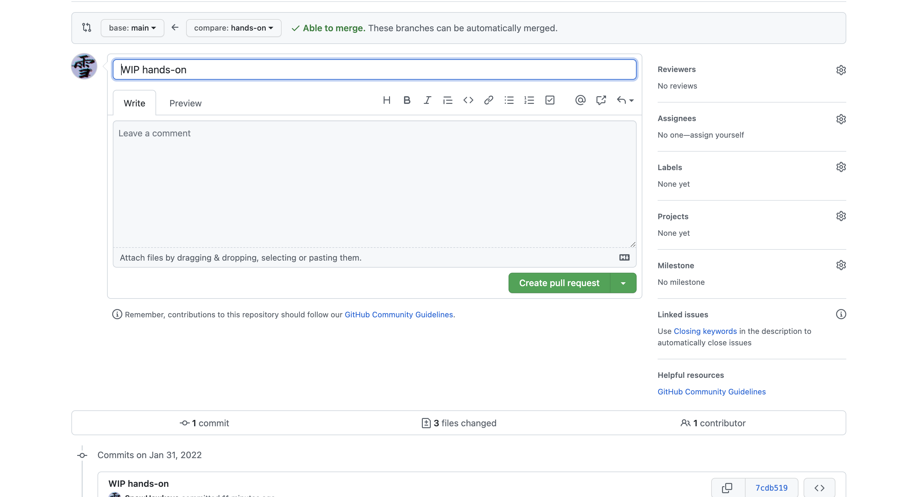

# Les bases de git

Ce petit exemple de mise en pratique permettra de lister et d'utiliser les commandes git les plus courantes.

## Prérequis

L'objectif étant de pratiquer l'utilisation de git, on supposera que les étapes suivantes sont des acquis : 

- Avoir installé git sur son ordinateur.

- Avoir un compte GitHub.

- Avoir les autorisations pour pusher vers un repository GitHub (autrement dit, le PC connaît vos identifiants).

## Situation

Vous venez de rejoindre une équipe de data science dans une entreprise qui travaille sur la conduite autonome. Ils ont développé une application tout-en-un intégrant des modèles de machine learning qui tourneront à bord de leurs véhicules.

A l'heure actuelle, leur base de code, contenue dans le dossier `mock-project` , comporte une seule feature fonctionnelle `movement detection`. Le package `core` contient du code qui peut servir à toutes les features.

L'objectif de votre session de travail est d'ajouter une toute nouvelle feature `sign detection`, et de la proposer à vos (fictifs) collègues pour relire votre code.

Le *git flow* en vigueur dans l'équipe est le suivant :

- La branche `project-main` reflète ce qui est en production. L'appplication étant encore en développement, rien n'y a encore été mergé.

- La branche `project-develop` est la branche de travail de l'équipe. C'est là que sont mergées les branches de feature lorsqu'elles ont été validées par l'équipe.

- Lorsqu'on travaille sur une nouvelle feature, il faut créer une branche `project-feature/$FEATURE_NAME$` à partir de `project-develop`.

- Avant de merger une branche de feature vers `project-develop`, il faut squasher ses commits en un seul commit respectant la convention : 
  
  ```git
  $FEATURE_NAME$ - $FEATURE_FUNCTION$:
      - $SUB_FEATURE1$
      - $SUB_FEATURE2$
      - ...
  ```
  
  où la liste de "sub-features" doit décrire ce qui a été fait dans le commit.

- Lorsque la branche de feature est "propre", une pull request doit être faite vers `project-develop`.

## Mise en place du projet

Afin de pouvoir travailler sur le projet, il faut le récupérer sur GitHub [à l'addresse du présent repository](https://github.com/SnowHawkeye/git-basics).

### Créer un fork du projet

En entreprise, vous auriez été ajouté en tant que collaborateur du projet. Ici, comme ce n'est pas le cas, vous ne pourrez pas pusher de code directement sur le repository.

Pour contourner ce problème, il suffit de créer un **fork** du projet, c'est-à-dire un miroir du repository qui vous sera propre. Pour cela, il suffit d'appuyer sur le bouton "Fork" en haut à droite de la page.

Naviguez maintenant vers votre version du repository : vous aurez maintenant tous les accès nécessaires.

### Cloner le repository en local

Appuyez sur "Code" et copiez l'URL du projet. 



Sur votre ordinateur, naviguez vers le dossier où vous voulez cloner le repository et ouvrez un terminal. En ligne de commande, vous pouvez utiliser : 

```bash
cd $PATH_TO_FOLDER
```

Puis importez le projet avec : 

```git
git clone $REPOSITORY_URL
```

Vous avez maintenant le dossier du repository dans vos fichiers locaux. N'oubliez pas d'y naviguer en ligne de commande avec `cd`.

## Travail sur le projet

### Vérifier les branches

Maintenant que vous avez récupéré le projet, un bon réflexe avant de commencer à travailler est de vérifier que vous êtes bien à jour avec la remote.

> Ici, il y a peu de risque puisque vous venez de télécharger le projet, mais en d'autres circonstances il est prudent de vérifier qu'on n'a pas oublier de se mettre à jour avec le travail de ses collègues.

Pour lister les branches que vous avez en local, utilisez :

```git
git branch
```

Vous verrez alors listées les branches que vous avez sur votre machine, en particulier celles qui nous intéressent : `project-main` et `project-develop`. Si elles n'apparaissent pas, vous pouvez utiliser la commande suivante pour aller les chercher en remote :

```git
git fetch
```

### Manipuler les branches

Maintenant que vous êtes prêt et à jour, vous aimeriez commencer à travailler sur la nouvelle feature. Vous allez donc créer une nouvelle branche pour coder. Le problème étant : vous ne savez pas encore quel nom a été convenu pour cette nouvelle feature, et vous ne pouvez donc pas encore créer une branche qui respecte la convention `project-feature/$FEATURE_NAME$`.

Toutefois, cela ne vous bloquera pas : il vous suffit de créer une branche temporaire que vous renommerez plus tard. Pour créer la branche, commencez par vous placer sur `project-develop` :

```git
git checkout project-develop
```

> Si vous partez de la mauvaise branche pour coder votre feature, vous risquez de ne pas avoir tout le code dont vous avez besoin, ou de générer des conflits en ramenant le votre plus tard.

Vous pouvez également regarder l'historique de la branche avec : 

```git
git log
```

> Utilisez les flèches pour monter / descendre dans l'historique. Si vous êtes "bloqués" dans le log, appuyez sur `q` pour quitter, ou sur `ctrl+C` qui est un raccourci plus général pour interrompre une commande.

Vous pouvez alors créer une nouvelle branche :

```git
git checkout -b tmp/sign
```

Si le nom ne vous convient pas, vous pouvez le changer avec :

```git
git branch -m $NEW_BRANCH_NAME
```

Vous êtes maintenant sur une nouvelle branche, qui n'existe qu'en local (puisque vous n'avez rien pushé) et sur laquelle vous pouvez faire tous les tests qui vous semblent utiles. Créez quelques fichiers, modifiez-en d'autres, faites-vous plaisir !

Après quelques essais, vous pouvez lister les fichiers qui ont été changés avec :

```git
git status
```

*A priori*, tous vos changements apparaissent en rouge est rien n'est `staged for commit` : vous n'avez aucune intention de garder ces changements.

Après votre réunion quotidienne, vous avez une idée plus claire de ce qui est attendu de vous : la feature s'appelle `sign detection`, et vous avez des instructions claires quant à ce que vous devez faire.

Vos tests n'ayant rien donné d'intéressant, vous décidez simplement de repartir de zéro en supprimant la branche et en en recréeant une nouvelle. Pour faire bonne mesure, vous décidez aussi d'annuler tous vos changements : 

```git
git reset --hard
git checkout project-develop
git branch -D tmp/sign
git checkout -b project-feature/sign-detection
```

Quelques notes sur les commandes ci-dessus : 

- `git reset --hard` **détruit tous vos changements** et vous remet dans l'état du dernier commit. A utiliser uniquement quand vous ne voulez rien garder. Ici, puisque la branche sera supprimée, sa seule utilité est de vous éviter d'avoir à commiter des changements que vous allez de toute façon perdre. Il existe des reset plus "soft" qu'on ne détaille pas ici.

- Pour supprimer une branche avec `git branch -D`, il faut se trouver sur une autre branche. C'est pourquoi on commence par retourner sur `project-develop`. On note que la branche n'est supprimée que localement !

- Une alternative ici aurait été de simplement renommer la branche après avoir utilisé `git reset --hard`.

- Vous remarquerez que la nouvelle branche créée respecte les conventions de nommage de l'équipe !

### Création d'une nouvelle feature

#### Ajout de modifications

Fort de ce travail préliminaire, vous êtes maintenant prêt à créer une nouvelle feature. Pour cela, les étapes suivantes sont nécessaires : 

- Créez un nouveau dossier `sign-detection` dans lequel vous placerez un fichier `SignDetectionCode.txt` où vous écrirez quelques lignes (peu importe le contenu, avoir des changements permettra d'avoir un commit plus "visuel" lorsqu'on fera une pull request par la suite).

- Ouvrez le fichier `CoreCode.txt` du package `core` et ajoutez-y une ligne.

- Du travail préparatoire avait été effectué avant votre arrivée, mais il est à un endroit de la codebase qui n'est plus pertinent. Déplacez le fichier `SignPrework.txt` vers le package `sign-detection`.

- Imaginons que votre code génère des fichiers annexes à l'exécution. Ajoutez un fichier `GeneratedCode.txt` n'importe où dans le repository.

> Tous ces "faux changements" n'ont d'objectif que de montrer les différents types de changement qui peuvent apparaître dans un commit. Certains d'entre eux seront utilisés pour illustrer d'autres points par la suite.

Si vous utilisez `git status`, vous devriez voir tous les changements que vous avez faits : le nouveau dossier, le fichier modifié, le fichier déplacé, et le nouveau fichier.

#### Les fichiers à ignorer

Vous aimeriez committer vos changements, mais vous ne voulez pas committer le fichier `GeneratedCode.txt`. En effet, ce type de fichier généré "automatiquement" est de toute façon regénéré à l'utilisation - en d'autres termes, il est inutile et générateur potentiel de conflits.

Une première solution consisterait à le supprimer, ou à ne pas l'ajouter aux fichiers à committer. Cela représente cependant une perte de temps à chaque fois que vous voulez committer quelque chose.

La bonne solution ici est d'ajouter le fichier au fichier `.gitignore` : c'est un fichier utilitaire qui indique à git tous les fichiers dont les changements sont à ignorer. Il est à la racine du repository.

> C'est un fichier caché. Si vous ne le voyez pas dans l'explorateur de fichiers, il faut :
> 
> - Sous Windows, aller dans l'onglet "Affichage" et cocher l'option correspondante.
> 
> - Sous Mac, utiliser le raccourci ⇧ + ⌘ + •

Il vous suffit de l'ouvrir et d'y ajouter une ligne avec le nom du fichier. Les fichiers `.gitignore` peuvent aussi accepter :

- Des noms de dossier (e.g. `ignore-me/`), tous les fichiers du dossier sont alors ignorés.

- Des extensions de fichier (e.g. `.ignoreme`), tous les fichiers ayant cette extension sont alors ignorés.

Si vous enregistrez le `.gitignore` et que vous utilisez à nouveau `git status`, vous devriez voir que le fichier "généré" n'est plus considéré comme ayant reçu des changements. En revanche, le `.gitignore` a maintenant été modifié.

> Le `.gitignore` étant un fichier "commun", il est déconseillé de le modifier unilatéralement comme nous venons de le faire (pour éviter les conflits). Dans la réalité, on préfère utiliser des `.gitignore` pré-faits. Voir par exemple [ce lien](https://www.toptal.com/developers/gitignore)).

#### Committer ses changements

Maintenant que notre liste de changements est "propre", nous pouvons maintenant les  committer, c'est-à-dire les enregistrer dans l'historique de notre branche.

Une pratique courante lorsqu'on veut faire relire son code à ses collègues est de créer plusieurs "petits commits" contenant peu de changements, mais explicites et faciles à digérer en code review. C'est une fois le code validé que l'on squashera ces commits en un seul "commit de feature", comme le veut notre convention d'équipe. 

> Ce type de manoeuvre est pratique lorsqu'on déplace / supprime beaucoup de fichiers, ce qui donne des changelists énormes et rend illisible les pull requests.

Pour illustrer ce cas de figure, nous allons donc créer deux commits à partir des changements qu'on a faits.

Le changement que nous avons fait qui est "à part" des autres est celui du `.gitignore`. Nous allons donc le committer séparément : 

```git
git add .gitignore
git commit -m "Update .gitignore"
```

Si vous utilisez à nouveau `git log`, vous verrez le nouveau commit apparaître dans l'historique. Avec `git status` vous devriez toujours voir vos changements pour les autres fichiers, mais plus pour `.gitignore`.

Nous allons maintenant créer un deuxième commit avec le reste des changements : 

```git
git add .
git commit -m "Sign detection feature"
```

Dans le code ci-dessus :

- `git add .` permet d'ajouter tous les changements que vous voyez dans `git status` au commit.

- Le message de commit ne respecte pas encore les conventions de l'équipe, mais vous aurez l'occasion de le changer par la suite quand vous squasherez les commits !

#### Uploader ses changements

Vous avez committé vos changements **localement**, il est maintenant temps de les uploader vers le repository en remote. Il est important de noter qu'une fois que les changements sont en ligne, les modifications telles que renommer une branche ou réécrire son l'historique deviennent dangereuses.

Pour envoyer vos changements en ligne, utilisez : 

```git
git push
```

Vous devriez avoir un message d'erreur : vous essayez de pusher vers une branche qui n'existe pas en remote ! La solution est simple : copiez-collez la commande proposée par le message d'erreur, qui devrait ressembler à quelque chose du genre : 

```git
git push --set-upstream origin project-feature/sign-detection
```

> `origin` désigne ici la remote, c'est-à-dire le repository vers lequel on pushe. Nous ne détaillerons pas ici le travail avec plusieurs remotes, mais cela ne change pas vraiment les commandes : il faut juste faire attention lorsqu'on push ou pull à choisir la bonne remote.

Maintenant que les changements sont en ligne, vous pouvez aller sur la page web de votre projet GitHub, et créer une pull request.

- Si votre push est récent, un bouton se présentera directement.

- Sinon, vous pouvez cliquer sur "branches", trouver votre branche dans la liste et cliquer sur "New pull request".




Lorsque la PR est ouverte, portez attention à :

- La branche vers laquelle vous voulez merger (pour nous, ce serait `project-develop`).

- Le titre et commentaire de votre PR : c'est par eux que vous communiquez avec votre équipe ce que fait votre PR - soignez-les !

- La liste des commits de la PR (vous devriez en voir 2 pour l'instant) et de vos changements. C'est une bonne façon de vérifier que vous faites une PR vers la bonne branche, et que vous avez committé ce que vous vouliez committer.

Lorsque vous êtes certain que tout est au propre, vous pouvez appuyer sur "Create pull request".





### Manipulation de l'historique

 
